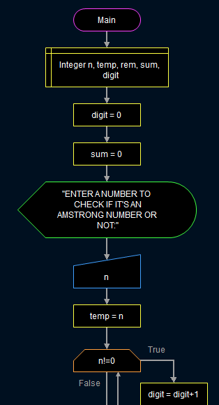
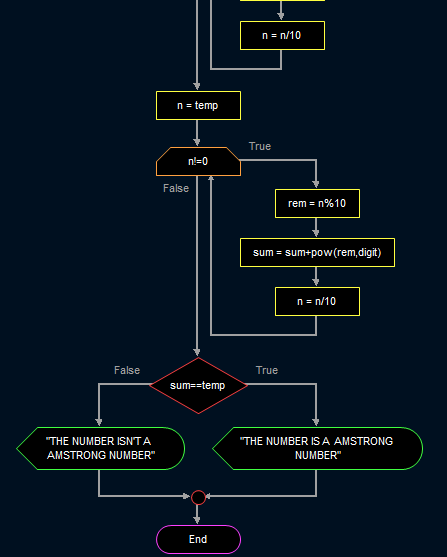

# **_PSEUDOCODE AND FLOWCHART(VIA FLOWGARITHM) TO FIND IF A GIVEN NUMBER IS AMSTRONG NUMBER OR NOT_**
---
## _**PSEUDOCODE**_

> **READ n**  
> **sum=o**  
> **digit=0**  
> **temp=n**  
> >**WHILE n!=0**  
>   **digit+=1**  
> **n=n/10**  
>  > **END WHILE**  
>  >>**n=temp**  
> >>>**WHILE n!=0**
> **rem=n%10**  
> **sum+=pow(rem,digit)**  
> **n=n/10**  
> **END WHILE**   
> >>>>**IF summ==temp**  
> **WRITE the number provided is amstrong number**    
> >>>>**ELSE**  
> **WRITE the number provided isn't an amstrong number**    
---
---  

 ## **_FLOWCHART BY FLOWGARITHM_**
 >> ### **_THE BELOW PICTURE DESCRIBES A FLOWCHART FOR CALCULATING POWER OF TWO NUMBERS THIS FUNCTION WILL LATER BE USED IN THE AMSTRONG NUMBER FLOWCHART_**
 >>   
   
   >> ### **_THE BELOW PICTURES IS THE FLOWCHART FOR FINDING THE IF A GIVEN NUMBER IS AN AMSTRONG NUMBER OR NOT_**  
   >>   
   >> 
   ---
   ---
     
        
  > # **_THANKYOU_**
