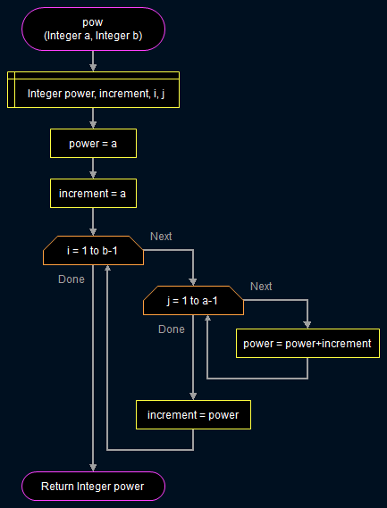

# **_PSEUDOCODE AND FLOWCHART(VIA FLOWGARITHM) TO FIND IF A GIVEN NUMBER IS AMSTRONG(NARCISSITIC) NUMBER OR NOT_**
---
# **_BASIC KNOWLEDGE OF AMSTRONG A.K.A NARCISSITIC NUMBERS_**
> ## **An Armstrong or a Narcissitic number is a number whoose sum of its digits raised to the number of the digits is equal to the number itself.**
> 
---
# _**PSEUDOCODE**_

> **READ n**  
> **sum=o**  
> **digit=0**  
> **temp=n**  
> >**WHILE n!=0**  
>   **digit+=1**  
> **n=n/10**  
>  > **END WHILE**  
>  >>**n=temp**  
> >>>**WHILE n!=0**
> **rem=n%10**  
> **sum+=pow(rem,digit)**  
> **n=n/10**  
> **END WHILE**   
> >>>>**IF summ==temp**  
> **WRITE the number provided is amstrong(narcissitic) number**    
> >>>>**ELSE**  
> **WRITE the number provided isn't an amstrong(narcissitic) number**    
---
---  

 ## **_FLOWCHART BY FLOWGARITHM_**
 > ### **_THE BELOW PICTURE DESCRIBES A FLOWCHART FOR CALCULATING POWER OF TWO NUMBERS THIS FUNCTION WILL LATER BE USED IN THE AMSTRONG(NARCISSITIC) NUMBER FLOWCHART_**
 >   
   
   >> ### **_THE BELOW PICTURE IS THE FLOWCHART FOR FINDING WHETHER THE  GIVEN NUMBER IS AN AMSTRONG(A.K.A NARCISSITIC) NUMBER OR NOT_**  
   >>   
   ---
   ---
     
        
  > # **_THANKYOU_**
